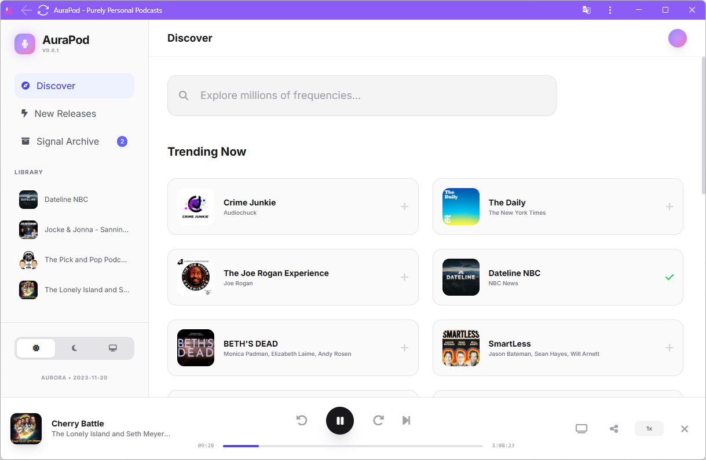

# AuraPod

[](https://github.com/macintorsten/aurapod/actions/workflows/test.yml)
[](https://github.com/macintorsten/aurapod/actions/workflows/deploy.yml)



A client-side podcast player web application built to run entirely in your browser.

**⚠️ Under Heavy Development**  
This project is in active development and is expected to have bugs, particularly related to CORS (Cross-Origin Resource Sharing) issues when fetching podcast feeds.

## Try It Out

🔗 **[Test AuraPod on GitHub Pages](https://macintorsten.github.io/aurapod/)**

## Development

**Prerequisites:** Node.js

1. Install dependencies:
   ```bash
   npm install
   ```
2. Run the dev server:
   ```bash
   npm run dev
   ```

## Testing

### Running Tests Locally

**Unit Tests (Vitest):**
```bash
# Run all unit tests once
npm test

# Run with coverage report
npm run test:unit

# Watch mode for development (re-runs tests on file changes)
npm run test:watch
```

**End-to-End Tests (Playwright):**
```bash
# Run E2E tests (builds the app first)
npm run test:e2e

# Run E2E tests with UI for debugging
npm run test:e2e:ui
```

If E2E fails locally due to missing browsers, run:
```bash
npx playwright install chromium
```

### Type Checking

**TypeScript Type Checking:**
```bash
# Check for TypeScript errors without building
npx tsc --noEmit

# Build the project (includes type checking)
npm run build
```

**Best Practice**: Run `npx tsc --noEmit` before pushing to catch type errors early.

For detailed testing patterns and best practices, see [TESTING_GUIDE.md](TESTING_GUIDE.md).
